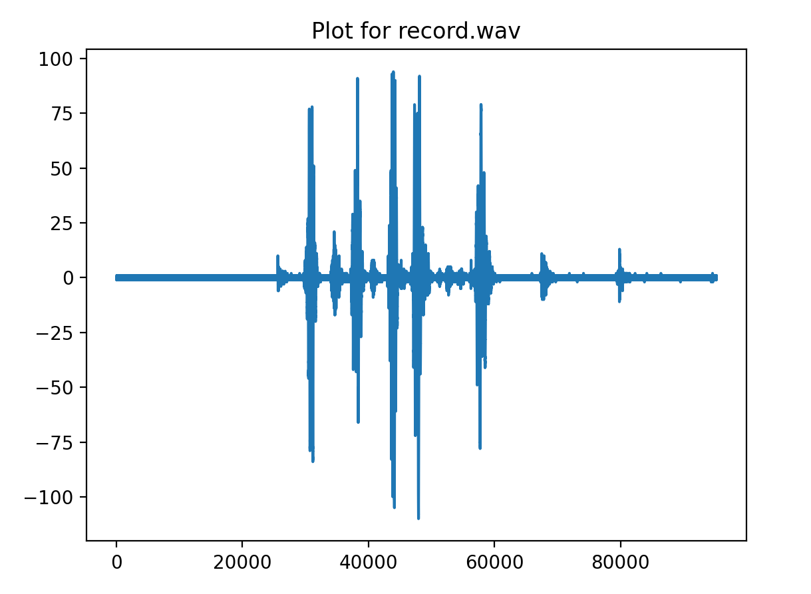
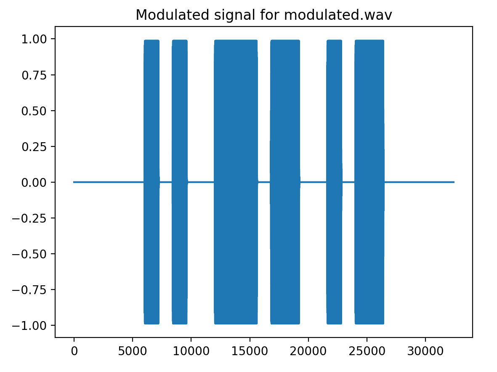
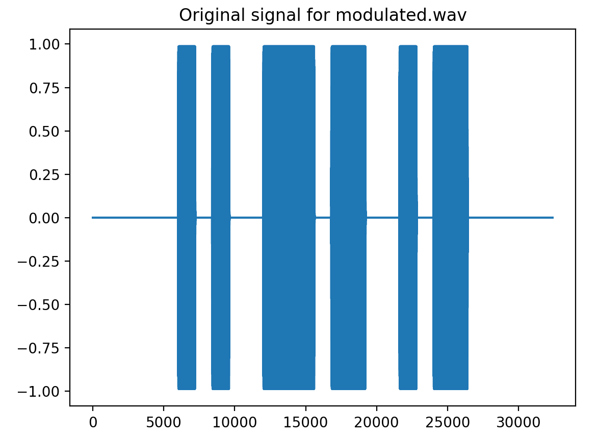
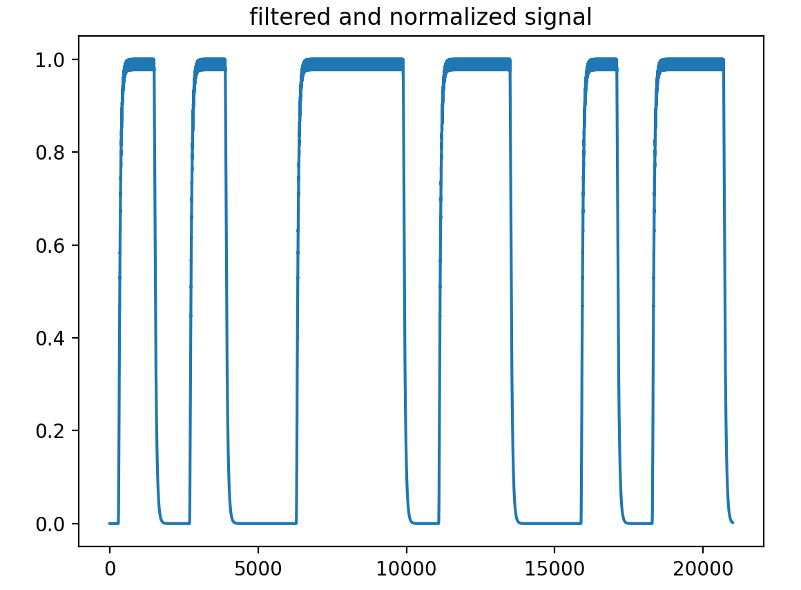

# 第一次作业 文档

软件03 陈启乾 2020012385

## 要求

1. 提交文档包括
    + 实验所实现的程序界面图和主要结果（文档中非必要不需要拷贝代码等）
    + 实验中遇到的困难以及如何解决（如没有可以不写）
        + 注1：实验报告须简明扼要、格式规范、内容详实，能反映实验过程和最终应用性能。
        + 注2：实验报告字数没有要求，不影响得分。
2. 实现代码和README说明文件
    + README文件中注明程序的运行方法，及如何重现相关实验结果
    + 代码请添加合理注释


## 程序使用

### 配置

请见 README.md 里面的依赖安装等环节。

具体的参数可以通过命令行提供，具体参见 README

### 任务一：生成声音

`python hw1.py --carrier_freq 441 generate output_sample.wav`

生成频率为 441Hz 的 2s 音频。可以在音乐播放器中播放。

### 任务三：录音

`python hw1.py record record.wav`

进行 2s 的录音完成后会在该文件夹增加一个时长为 2s 的 record.wav 文件。

### 任务二：读取录音

`python hw1.py plot record.wav`

程序会显示 record.wav 的波形：



（这里是随机的声音，并非调制后的音频的录音）


### 任务四：调制与解调

调制：`python hw1.py modulate modulated.wav --data 0 1 0 0 1 1 1 0 1 1 0 0 1 0 1` 

解调：`python hw1.py demodulate modulated.wav`

调制时，会在屏幕上显示调制的波形，随后存储到 modulated.wav 文件中：



解调时，会在屏幕上首先显示原始的波形：



随后显示滤波 & 解调 & 标准化之后的波形：



最后在命令行输出最终结果

```
data_len:  15
data:  [0.288 0.701 0.288 0.    0.703 0.989 0.989 0.286 0.701 0.989 0.288 0.   0.703 0.288 0.703]
[0 1 0 0 1 1 1 0 1 1 0 0 1 0 1]
```

## 具体实现提要，难点分析

1. 对 Wav 文件的操控采用 `scipy.io.wavefile` 实现。
2. 滤波采用 `scipy.signal` 中的函数实现。
3. 录音功能采用 `pyaudio` 相关函数实现。
4. 对真实世界的音频解码采用 ffmpeg 实现。
5. 在输出调制信号时，采用带通滤波；在解调信号时，对信号取绝对值后，采用低通滤波（单个脉冲长度对应频率的 4 倍）得到矩形波信号。
6. 解调信号时，先对信号取绝对值并进行线性滤波，得到一个平滑后的信号后，利用此时的最大值，找到信号的开始和结束点。
7. 调制信号时，为了让其能够在真实世界中传播，为了标识起点和终点，在给定输入信号前后各加了 1 个 ”1“；为了减少爆鸣，在上一步的基础上又在前后添加了五个 ”0“