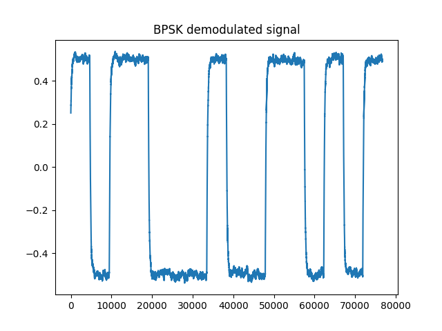

# 第二次作业 文档

软件03 陈启乾 2020012385

## 任务1: PIM 脉冲间隔调制

### 调制

1. 生成脉冲
2. 补充不同长度的空白成为 0 和 1 的编码
3. 根据数据生成调制信号
4. 特殊处理：在前面 pad 0.03 秒的空白，在后面加上一个额外的脉冲（标志着结束）

### 解调

1. 带通滤波器滤出载波频率附近的波
2. hilbert 求出包络
3. 找到每一个脉冲的出现时间，用两两之间的时间差来判断是 0 还是 1

### 结果

|  |  |
| ------------------------- | --------------------------- |

程序输出：

```shell
(iot) PS C:\Users\chenqq\Downloads\iot-homework> python .\hw2.py
PIM, data=[0 1 0 0 1 1 1 0 1 1 0 0 1 0 1], result=[0 1 0 0 1 1 1 0 1 1 0 0 1 0 1], correct rate=1.0
```

## 任务2：BPSK 二进制相移键控调制

### 调制

1. 生成一个余弦波，长度为调制符号长度
2. 如果数据是 1，就将余弦波反相，否则不变，按照 data 的顺序拼接起来


### 解调

1. 使用相干解调，将信号与载波相乘
2. 使用低通滤波器滤出符号，去除高频部分
3. 在前后 padding 后找到起始和结束部分
4. 使用采样/平均方法，将每个符号的平均值作为判断依据
5. 二值化到 0 和 1

|  |  |
| -------------------------- | ---------------------------- |

命令行输出：

```shell
(iot) PS C:\Users\chenqq\Downloads\iot-homework> python .\hw2.py
BPSK, data=[0 1 0 0 1 1 1 0 1 1 0 0 1 0 1 0], result=[0. 1. 0. 0. 1. 1. 1. 0. 1. 1. 0. 0. 1. 0. 1. 0.], correct rate=1.0
```

## 任务三：有噪音情况

### 根据信噪比生成噪音

这里根据振幅来生成噪音，振幅越大，信噪比越低。

如信噪比为 `db` 分贝，信号的振幅为 `signal_amp`，那么噪音的振幅为 `noise_amp = signal_amp / (10 ** (db / 20))`。

### 正确率

```shell
(iot) PS C:\Users\chenqq\Downloads\iot-homework> python .\hw2.py
PIM correct_rate:
        20dB: 1.0
        10dB: 1.0
        5dB: 1.0
        0dB: 1.0

BPSK correct_rate:
        20dB: 1.0
        10dB: 1.0
        5dB: 1.0
        0dB: 1.0
```


具体图表仅展示 20dB 和 0dB 的情况。

调制的信号：

|       | PIM                                          | BPSK |
| ----- | -------------------------------------------- | ---- |
| 0 dB  |   |      |
| 20 dB |  |      |

调制的信号：

|       | PIM                                          | BPSK |
| ----- | -------------------------------------------- | ---- |
| 0 dB  |   |      |
| 20 dB |  |      |

可以看出 0 dB 的信噪比时，信号更加不稳定。

### BPSK 符号长度的影响

```shell
(iot) PS C:\Users\chenqq\Downloads\iot-homework> python .\hw2.py
BPSK correct_rate:
        Time 2: 1.0
        Time 4: 1.0
        Time 8: 1.0
        Time 16: 1.0
```

|      |  调制    | 解调     |
| ---- | ---- | ---- |
|  2倍时间    |  |      |
|  4倍时间    |      |      |
|  8倍时间    |      |      |
|  16倍时间    |      |      |

虽然正确率都是 100%，但可以看出来，随着时间边长，信号逐渐变得更加稳定。
