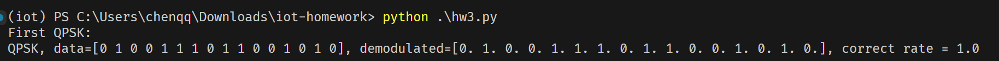
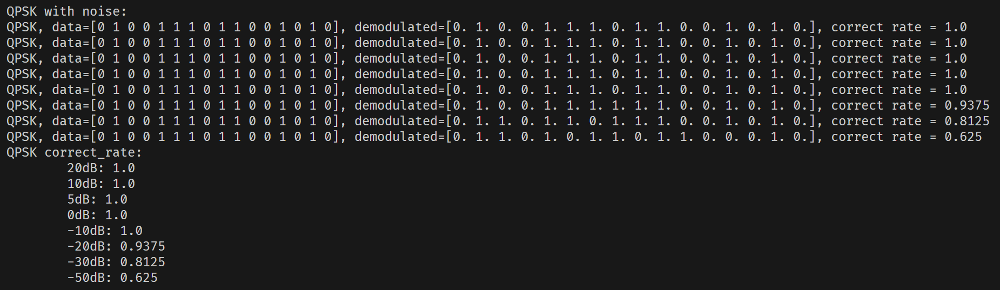
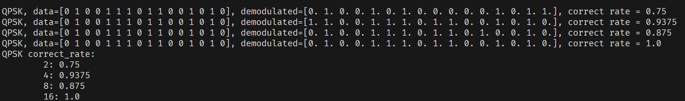
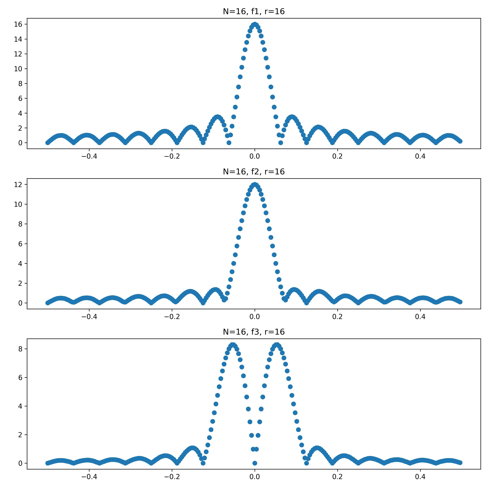
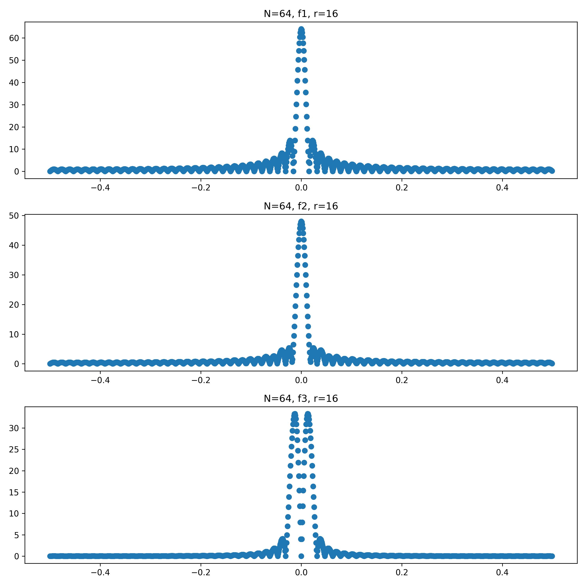
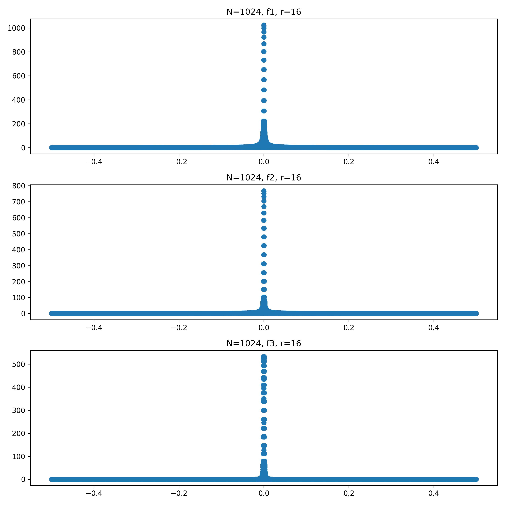

# 第三次作业 文档

软件03 陈启乾 2020012385

## 任务一：QPSK 正交相移键控

### 调制

1. 将数据分为两路，分别为 I 和 Q，I 使用 sin 波，Q 使用 cos 波
2. 根据每两位的信号，将 I 和 Q 的波进行相位调整，相加后得到新的信号

### 解调

1. 构造信号 I 和 Q，分别为 sin 和 cos 波
2. 构造信号矩阵 sigMat = [I+Q, I-Q, -I+Q, -I-Q]
3. 将信号与 sigMat 做点乘，得到每个信号与四个信号的相关性
4. 找到相关性最大的信号，即为解调结果

## 任务二：有噪声时的性能

### 不同信噪比

信噪比越高，准确率越高。

### 不同信号时间（-30dB）

总体上来说，信号时间越长，准确率越高

## 任务三：傅里叶变换频谱分析

1. 进行傅里叶变换
2. 将负频率放到左侧
3. 画图

这里采用了 16 倍的补 0 系数。

### N = 16

### N = 64

### N = 1024

