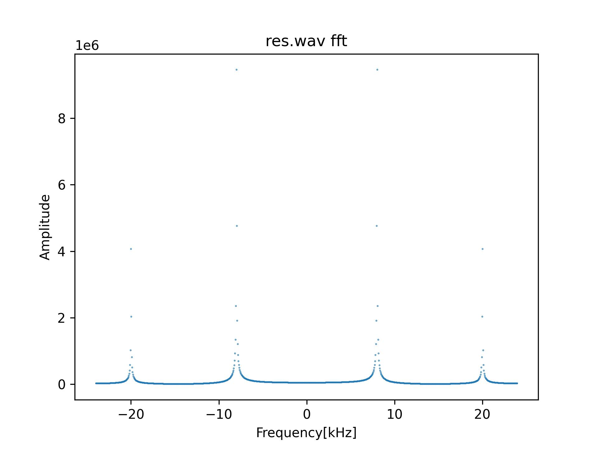
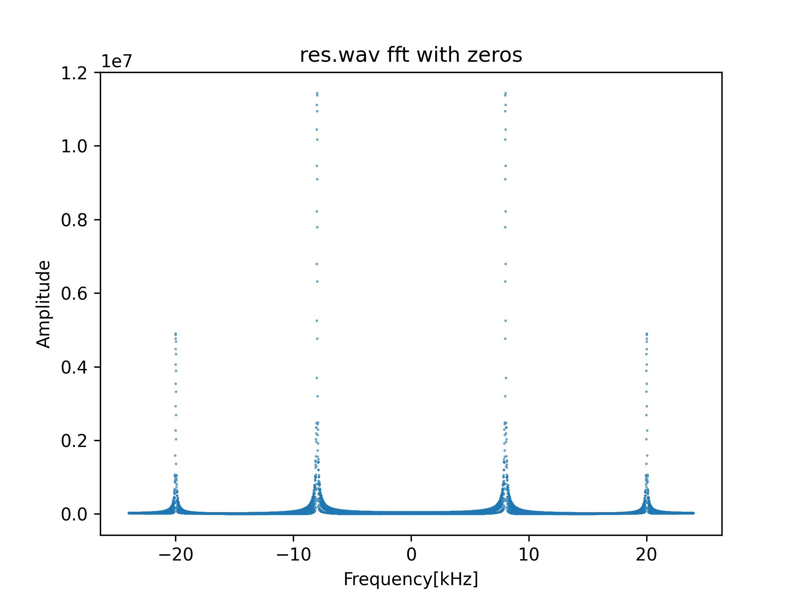
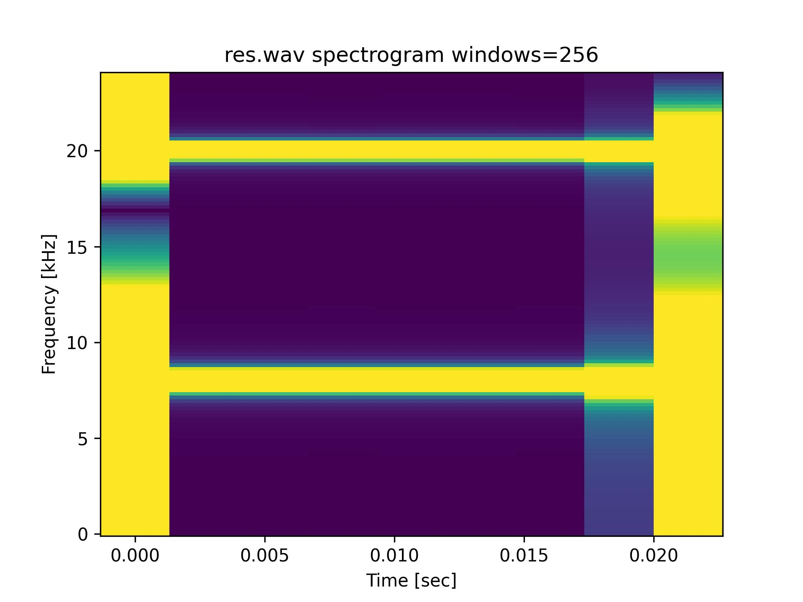
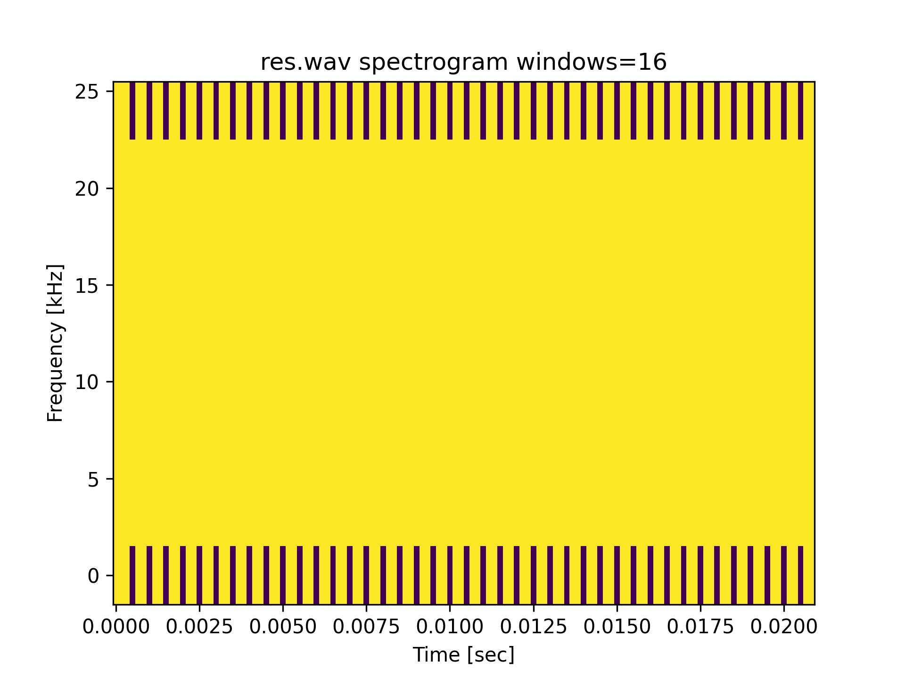
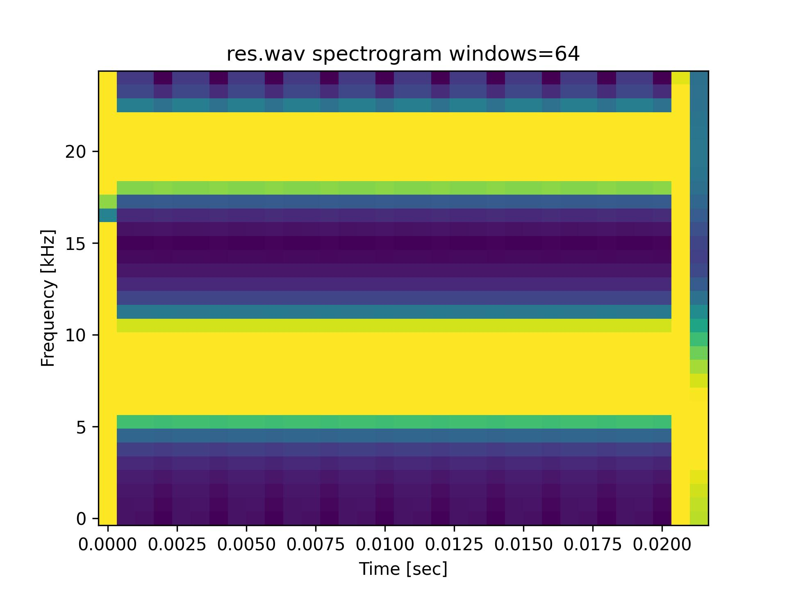
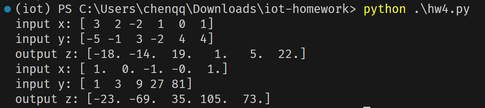

# 第三次作业 文档

软件03 陈启乾 2020012385

## 任务一：频谱分析

### 频谱图

### 补零后的频谱图

补零对信号频谱的影响：

- 信号的频谱图变得更加平滑
- 信号的频谱图变得更加精确

# 时频图

### 窗口大小对时频图的影响

| 窗口大小 | 时频图 |
| -------- | ------ |
| 16       |  |
| 64       |  |
| 256      |  |

- 窗口越大，时频图的时间分辨率越低，频率分辨率越高
- 窗口越小，时频图的时间分辨率越高，频率分辨率越低

## 任务二：循环卷积

用户可以通过调用 `cyclic_convolution` 实现输入数组进行循环卷积；在程序最后也可以从键盘中输入两个数组进行测试。

结果：

